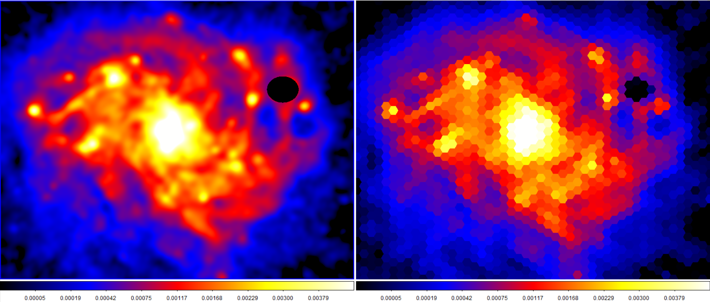

# HexFITS

A hexbin tool for radio astronomy observations.

## Motivation

I needed it for a project.

The image, beam, and pixel size of a fits image are used to determine a gridsize
for the hexbin which produces hexagons that are approximately equal in area to one beam size.
This means each bin is effectively an individual resolved element. Hexagons are chosen as they
are closer in area to an equivalent circular beam than a square bin, but still stack efficiently.

Note that the positions of the bins are arbitrary depending on your image. As long as the image, beam, 
and pixel size match between two images you should get the same bin size and positions for both images.  
This is not useful for precisely targeting specific regions, but can give a broad overview of a points 
in an extended structure.

## Usage

Clone the repo, activate the project, then use the hexbin tool with a path to a FITS file with
appropriate header information. 

hexbin("/path/to/file.fits")

This will produce a new file with the suffix *-hexbin.fits that maintains the original header information.

Currently your image will need to be square and contain the following keys in the header for 
the gridsize to be determined: NAXIS1, CDELT2, BMAJ, BMIN.

This has only been tested on FITS images produced by CASA's exportfits task.

## Acknowledgements

The way the hexbin is handled here is based on the same function in [Matplotlib](https://github.com/matplotlib/matplotlib).

